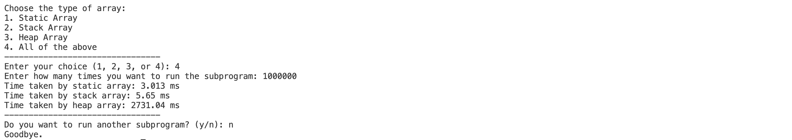
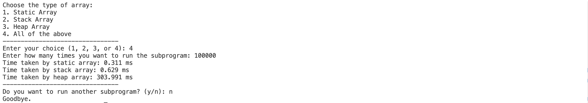
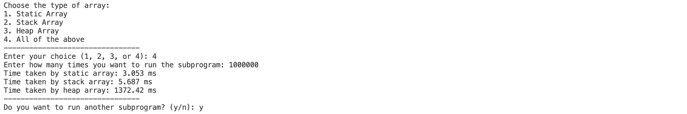
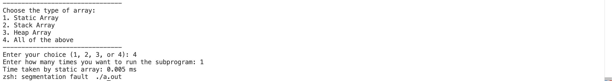
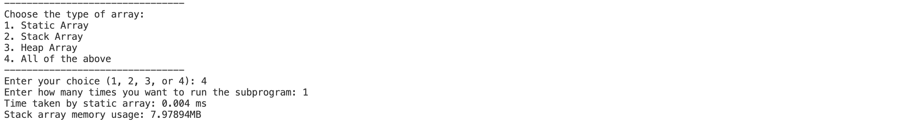

[](https://classroom.github.com/a/gYiweL7m)

# Assignment 2 - Typеs and OOP concеpts

## Task 1
### Task definition
The expectations for this task were to compare **static array**, **stack array**, and **heap array** by their execution time in either C or C++. To achieve comparable results, large arrays were used and each subprogram was called many times (at least 100,000).

### Performance testing method
Each of the three array allocation methods was called many times in a loop, and the total execution time was measured using the ```clock()``` function. 

## Explanation of results
Results of 1,000,000 calls for each subprogram for an array size of 2,091,630: 



This was the maximum array size that could be used without getting stack overflow (further explanation below). It is obvious that heap array allocation is much more time complex compared to the other two. To get a better understanding, here is the result with the same array size and 100,000 (10 times less than previous example) calls:



This time, as expected, the time taken by each array dropped proportionately to the difference between number of calls. Let's do two more comparisons with 1,000,000 and 100,000 calls again but with a 2 times smaller array size of 1,045,815:

1 million calls:


100k calls:


**The wrap-up of results for a better visual comparison:**
| Array Size | Iterations  | Static Array (time in ms) | Stack Array (time in ms) | Heap Array (time in ms) |
|------------|-------------|---------------------------|--------------------------|--------------------------|
| 2,091,630  | 1,000,000   |      3.013                |        5.65              |       2731.04            |
| 1,045,815  | 1,000,000   |      3.053                |        5.687             |       1372.42            |
| 2,091,630  | 100,000     |      0.311                |        0.629             |       303.991            |
| 1,045,815  | 100,000     |      0.311                |        0.607             |       154.39             |


### Static Allocation

For all tests, static array showed the fastest results. It was almost two times faster than the second fastest, stack array. There is a simple reason for that difference: memory (static) for this array gets allocated at compile time. Meaning, this memory gets initialized once throughout the entire program run, and only gets reused in loop function calls. The address of the array is in executable itself and it does not change. Static arrays are usually used when:

1. Array size does not ever need to change during runtime;
2. Performance is a priority (static arrays avoid overhead);
3. Persistent memory is needed.

In the tests, static array allocation time did not grow with array size, but it grew with iteration number. This means difference in array size should not affect the time required by allocation. The increase in time due to iteration (subprogram call times) is only because the array is accessed more times.

Since array size cannot be changed during runtime, there is less flexibility in using static arrays. Additionally, memory allocated is reserved during the execution of the program, and it will not be deallocated even when the array is not used anymore. 

### Stack Allocation

Stack array allocation was also very fast, but slower than static array. This is because unlike static arrays, in stack, memory gets allocated at runtime. The stack is a **Last-In-First-Out (LIFO)** data type, and allocating memory for stack happens with moving the pointer. The stack also has a fixed size, but it no longer occupies memory after function exits. Stack arrays are usually used when: 

1. Fast memory allocation is needed for temporary arrays in functions;
2. The array size is limited (stack overflow);
3. Memory management is a priority (static arrays are deallocated after function returns).

Like in static, in the tests, static array allocation time only grew with the number of calls to the program. This is because the time to allocate memory is independent of the array size. No matter how large or small an array is (as long as it does not exceed memory limitations), only stack pointer is adjusted on each call.

**Opinions on stack overlow**
After testing, maximum array size without getting stack overflow was about 2091630. For example, for an array size of 2100000, this was the result:



Notice the times subprogram was run is only 1. Stack overflow happening depends on declared array size and not on how many times it was declared. Turns out maximum available memory for stack allocation is 8 MB on this machine. This was verified by printing the result using this line of code: 

```C++
cout << "Stack array memory usage: " << sizeof(arr) / (1024.0 * 1024.0) << "MB" << endl;
```

Printed result:


### Heap Allocation

# TODO: Complete heap allocation and wrap-up

## Final Comparison and Wrap-up

| Array Type | Allocation Speed  | Memory Limit           | Memory Management          | Use Case                               |
|------------|-------------------|------------------------|----------------------------|----------------------------------------|
| Static     | Fast              | Fixed at compile time  | Automatic                  | Fast access to fixed-size arrays       |
| Stack      | Fast              | Limited by stack size  | Automatic (LIFO)           | Temporary, fast-access memory          |
| Heap       | Slow              | Limited by system RAM  | Manual (must be freed)     | Large or dynamically sized arrays      |