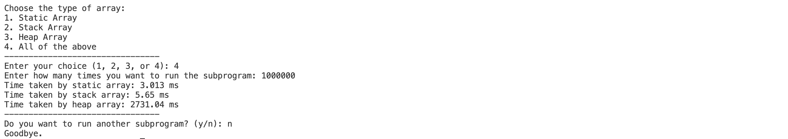
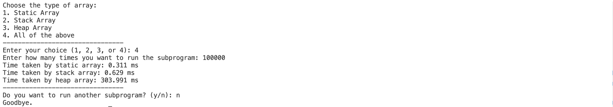
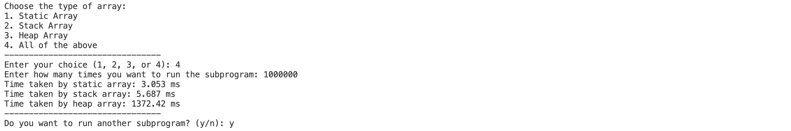
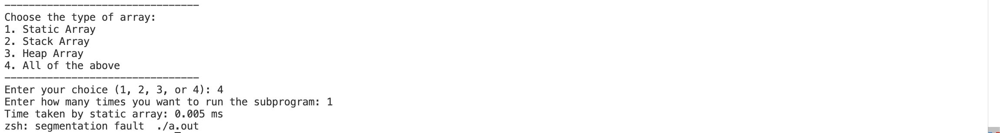
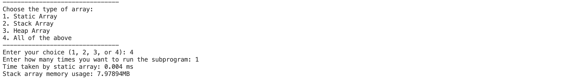
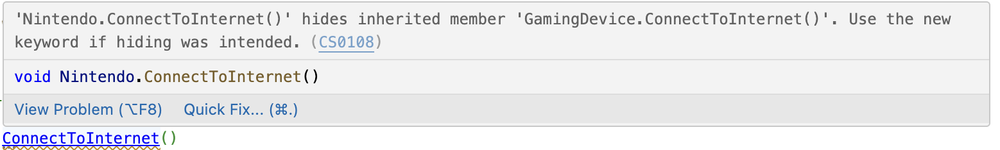
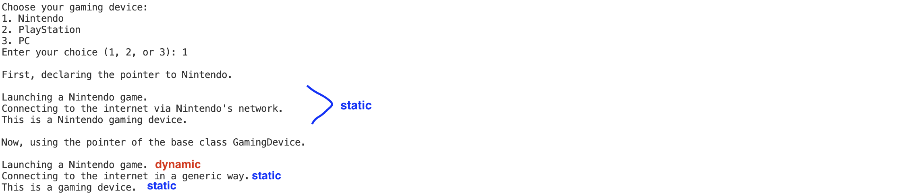
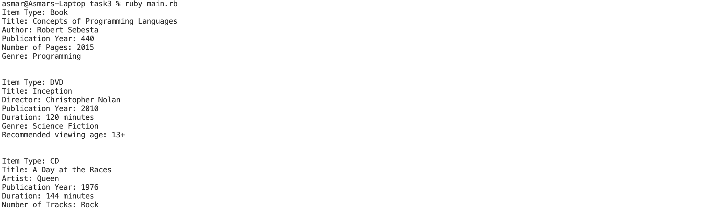

[](https://classroom.github.com/a/gYiweL7m)

# Assignment 2 - Typеs and OOP concеpts

## Task 1
### Task definition
The expectations for this task were to compare **static array**, **stack array**, and **heap array** by their execution time in either C or C++. To achieve comparable results, large arrays were used and each subprogram was called many times (at least 100,000).

### Performance testing method
Each of the three array allocation methods was called many times in a loop, and the total execution time was measured using the ```clock()``` function. 

## Explanation of results
Results of 1,000,000 calls for each subprogram for an array size of 2,091,630: 



This was the maximum array size that could be used without getting stack overflow (further explanation below). It is obvious that heap array allocation is much more time complex compared to the other two. To get a better understanding, here is the result with the same array size and 100,000 (10 times less than previous example) calls:



This time, as expected, the time taken by each array dropped proportionately to the difference between number of calls. Let's do two more comparisons with 1,000,000 and 100,000 calls again but with a 2 times smaller array size of 1,045,815:

1 million calls:



100k calls:


**The wrap-up of results for a better visual comparison:**
| Array Size | Iterations  | Static Array (time in ms) | Stack Array (time in ms) | Heap Array (time in ms) |
|------------|-------------|---------------------------|--------------------------|--------------------------|
| 2,091,630  | 1,000,000   |      3.013                |        5.65              |       2731.04            |
| 1,045,815  | 1,000,000   |      3.053                |        5.687             |       1372.42            |
| 2,091,630  | 100,000     |      0.311                |        0.629             |       303.991            |
| 1,045,815  | 100,000     |      0.311                |        0.607             |       154.39             |


### Static Allocation

For all tests, static array showed the fastest results. It was almost two times faster than the second fastest, stack array. There is a simple reason for that difference: memory (static) for this array gets allocated at compile time. Meaning, this memory gets initialized once throughout the entire program run, and only gets reused in loop function calls. The address of the array is in executable itself and it does not change. 

Static arrays are usually used when performance is a top priority, and array size does not ever need to change during runtime. Since array size cannot be changed during runtime, there is less flexibility in using static arrays. Additionally, memory allocated is reserved during the execution of the program, and it will not be deallocated even when the array is not used anymore. 

In the tests, static array allocation time did not grow with array size, but it grew with iteration number. This means difference in array size should not affect the time required by allocation. The increase in time due to iteration (subprogram call times) is only because the array is accessed more times.


### Stack Allocation

Stack array allocation was also very fast, but slower than static array. This is because unlike static arrays, in stack, memory gets allocated at runtime. The stack is a **Last-In-First-Out (LIFO)** data type, and allocating memory for stack happens with moving the pointer. The stack also has a fixed size, but it no longer occupies memory after function exits. Stack arrays are usually used when: 

Stack array should be used when memory management is a priority and the array size is not too large, because it gets deallocated after function returns and it has size limitations. It is a good choice for temporary arrays that are used in a small part of the program.

Like in static, in the tests, static array allocation time only grew with the number of calls to the program. This is because the time to allocate memory is independent of the array size. No matter how large or small an array is (as long as it does not exceed memory limitations), only stack pointer is adjusted on each call.

**Opinions on stack overlow**

After testing, maximum array size without getting stack overflow was about 2091630. For example, for an array size of 2100000, this was the result:



Notice the times subprogram was run is only 1. Stack overflow happening depends on declared array size and not on how many times it was declared. Turns out maximum available memory for stack allocation is 8 MB on this machine. This was verified by printing the result using this line of code: 

```C++
cout << "Stack array memory usage: " << sizeof(arr) / (1024.0 * 1024.0) << "MB" << endl;
```

Printed result:



### Heap Allocation

Heap allocation was the slowest in all test cases. In heap allocation, memory gets allocated dynamically during runtime. This additionally allocated memory stays allocated until it is deallocated in the code (```delete[]```). So, heap allocation is the slowest among three due to overhead in dynamic memory management 

Heap array is used when the final array size is not known at the start of the program and it can change during execution. Additionally, heap has access to larger memory, so its array size is much less limited compared to stack. Unlike stack, the allocated memory for heap arrays stay allocated after function returns if it is not manually removed, so heap array is also the more optimal choice when we need the array to be present outside the function.

Unlike static and stack array, heap array allocation time got affected by the increase in array size as well. It is probably also because of dynamic memory management, as heap searches for a large enough free block of memory for the specific allocation. From assignment 1 task 2, we learned that dynamic arrays usually allocate more memory when it is needed at start, and allocates more when the limit is reached each time, so, this should also affect the execution time.

## Final Comparison and Wrap-up

| Array Type | Allocation Speed  | Memory Limit           | Memory Management          | Use Case                               |
|------------|-------------------|------------------------|----------------------------|----------------------------------------|
| Static     | Fast              | Fixed at compile time  | Automatic                  | Fast access to fixed-size arrays       |
| Stack      | Fast              | Limited by stack size  | Automatic (LIFO)           | Temporary, fast-access memory          |
| Heap       | Slow              | Limited by system RAM  | Manual (must be freed)     | Large or dynamically sized arrays      |

To conclude, static arrays and stack arrays are fast, but better to use when the array size is not too big. Their allocation time does not get affected by array size. In contrast, heap array allocation is slower, but it allows the usage of larger and growing arrays. Its allocation time get longer as the array size grows.


## Task 2
### Task definition
The goal of this task to write a C# program that uses ***dynamic*** and ***static*** binding in OOP. Another requirement is to demonstrate the use of *new*, *virtual*, and *override* keywords.

### Structure in task2
```
├── Devices
│   ├── GamingDevice.cs
│   ├── Nintendo.cs
│   ├── PC.cs
│   └── PlayStation.cs
├── Program.cs
└── task2.csproj
```

### Static binding and Dynamic binding
***Static binding*** is when the method calls are resolved at compile time. Meaning, it will not be affected by polymorphism during the runtime. With static binding, when you create a reference to a base class object and assign it to derived class, for ex. ```baseClass ptr = new derivedClass()```, still the base class original method will be called even if derived class has also declared its own method with the same name. This is because the method is bound to base class in the compile time. Non-virtual methods (the ones not declared with *virtual* keyword) are static methods.

The *new* keyword in derived class methods shows that the derived class method hides base class method. It is useful when you create a direct reference to derived class itself, for ex. ```derivedClass ptr = new derivedClass()```. Then when you run call its methods, derived class methods are called via static binding and hiding. In this solution, we get a warning like this when deleting the new keyword in derived class redeclaration:



***Dynamic binding*** is when the method calls are resolved at runtime. For it to happen, the method should be defined in base class using *virtual* keyword. Unlike static binding, invoked method does not depend on reference type, instead it depends on object type during runtime. With this, even if you declare the derived class via base class pointer like ```baseClass ptr = new derivedClass```, the last defined method will be called (even when you call the method from child of a child). In C#, when a method that exists in the base class is defined in child class as well (Polymorphism), *override* keyword is used to show that base class method is overridden.

### Solution explanation
For solution, first GamingDevice base class was declared, then derived classes Nintendo, PC, and Playstation. Base class has one virtual method and two non-virtual methods for comparison. Similarly, derived classes each has one method with *override* keyword that demonstrated virtual binding, and two static binding methods. The code is tested by using two types of declarations: 

1. Child class Pointer
2. Base class Pointer

Here is the result that demonstrates both outputs:



### How to run
To run this program:

1. Navigate to [Task 2](task2)
2. Type and run ```dotnet run``` in the command line.


## Task 3
### Task definition
The main objective was to create a **LibraryItem** class in Ruby with three child classes: **Book**, **DVD**, **CD**, and a **Library** class to add items to the library, remove items from the library, and display item information. Each item has common properties like title, creator, and publication year, and unique items. To start writing the solution, the main source for syntax was [Ruby Style Guide](https://rubystyle.guide/#crlf).

### Classes and Methods
#### 1. LibraryItem (base class)

    - **Attributes**: title, creator, pub_year, genre(optional), rating(optional)
    - **Methods**:
        - *initialize*: sets up common attributes.
	    - *display_info*: displays the basic information that all library items have in common.

#### 2. Book (inherits from LibraryItem)

	- **Additional Attributes**: num_pages
	- **Additional Methods**:
	    - *long_book?*: returns true if the book has more than predefined (500) number of pages.
	    - *display_info*: displays information specific to books (number of pages). Creator from the base class is labeled as Author here.

#### 3. DVD (inherits from LibraryItem)

	- **Additional Attributes**: duration, age_restriction
	- **Additional Methods**:
	    - *long_movie?*: returns true if the DVD is longer than given (120 minutes) amount of time.
	    - *display_info*: displays information specific to DVDs - duration and recommended viewing age. Creator from the base class is labeled as Director here.

#### 4. CD (inherits from LibraryItem)

	- **Additional Attributes**: num_tracks, duration
	- **Additional Methods**:
	    - *long_album?*: returns true if the total duration of the album is longer than given amount of time (60 minutes).
	    - *display_info*: displays information specific to CDs - number of tracks and total duration. Creator from the base class is labeled as Artist here.

#### 5. Library

	- **Attributes**: items (an array that holds all library items)
	- **Methods**:
	    - *add_item*
	    - *remove_item*
	    - *display_all_items*: displays all items via each item’s display_info method.
	    - *display_catalog*: similar to display_info, but provides a shorter information with just name, creator, and year.

### Additional Notes

According to [Ruby Style Guide](https://rubystyle.guide/#crlf), name of the methods that return a boolean value should end with ? (question mark) That is why some method names end with question mark. From personal point of view, question mark sometimes decreases readability, but in this case, it helps understand the purpose of the method more quickly.

Keyword arguments work differently from Python. In Python, with optional arguments, if we provide the keyword, order did not matter. However, the same code in Ruby just assigns the value to the argument that is in order even if we specify the keyword. For example:

DVD initialize method starts with this line:

```Ruby
def initialize(title, director, pub_year, duration, genre=nil, rating=nil, age_restriction=nil)
```

in [main.rb](task3/main.rb), when the DVD item is created like this:
```Ruby
dvd = DVD.new("Incеption", "Christophеr Nolan", 2010, 120, "Sciеncе Fiction", age_restriction=13)
```

Ruby thinks 13 belongs to rating:


For it to assign everything correctly, every argument must be written in correct order, even if they are optional arguments:
```Ruby
dvd = DVD.new("Incеption", "Christophеr Nolan", 2010, 120, "Sciеncе Fiction", rating=nil, age_restriction=13)
```


### How to run

To run this program: 

1. Navigate to [Task 3](task3)
2. Type and run ```ruby main.rb``` in the command line.

The output should look like this:

